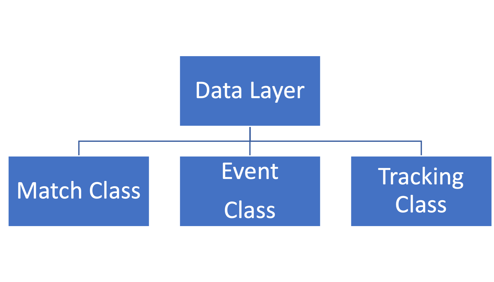

# EFI
An Open-Source Implementation of FIFA's Enhanced Football Intelligence

## Overview
This library serves as an open-source implementation of the metrics outlined in FIFA's Enhanced Football Intelligence document. Its purpose is to validate these concepts using data from FIFA World Cup 2022. The goal is to make these concepts accessible to researchers, analysts, and enthusiasts, enabling them to reproduce [FIFA's match reports](https://www.fifatrainingcentre.com/en/fwc2022/post-match-summaries/post-match-summary-reports.php) and gain valuable insights into football performance analysis. The library assesses the concepts presented in the EFI document to determine if they provide sufficient information for generating FIFA's match reports. It also includes potential improvements to address any ambiguities.

## Content
The repository is organized into documentation, source code, optimization, and results sections. The documentation includes the thesis, EFI document, and related images used to illustrate the library. The source code contains files with classes that form the implementation and a file demonstrating the use of the classes. Optimization involves parameter optimization processes for specific concepts, showcasing their search space and plotted choices. The results section presents the output of each concept for each match, visually representing the outcomes.

## Data
The data used for the analysis is not available due to confidentiality reasons.

## Installation
To download the open-source implementation of the EFI, copy paste the following command to your command line.

`git clone https://github.com/doganparlak/EFI.git`

## Library Design
The library is structured with three main layers: data layer, concept layer, and performance/visualization layer.

The data layer includes the Match class, Event class, and tracking class, which initiate data objects for use in the concept layer.

The concept layer is primarily represented by the EFI class, implementing the metrics detailed in the EFI document.

The performance and visualization layer is facilitated by the Visualizer class, which presents the results from the concept layer in an organized and visually enhanced format for interpretation.

## Author
The author of the project is [Dogan Parlak](https://doganparlak.github.io).

## Acknowledgements
I would like to express my deepest gratitude to my co-supervisor, [Prof. Dr. Ulrik Brandes](https://gess.ethz.ch/en/the-department/people/person-detail.html?persid=239462), for his invaluable guidance, unwavering support, and profound expertise throughout the development of this implementation.

I am also grateful to my supervisor, [Prof. Dr. Claudio J. Tessone](http://www.ifi.uzh.ch/en/bdlt/Team/Tessone.html), for his continuous support and valuable input.

I extend my sincere appreciation to [Hadi Sotudeh](https://sn.ethz.ch/profile.html?persid=299928), for his encouragement, enlightening discussions, and feedback during the course of this research.

